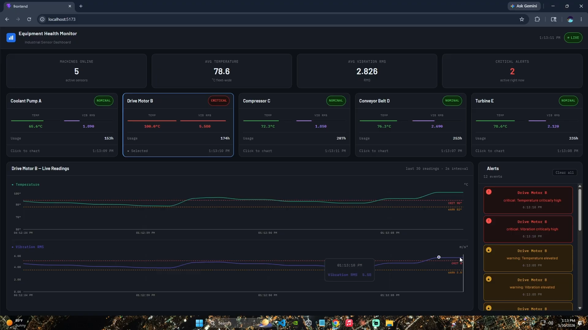

# Real-Time Equipment Health Monitor

A full-stack industrial IoT monitoring dashboard that simulates, ingests, and visualizes real-time sensor data from factory equipment. Built to demonstrate end-to-end systems thinking — from data ingestion and anomaly detection to a live React dashboard.

[](https://youtu.be/UuR9kfB3NR0)

---

## Tech Stack

**Frontend**
- React 18 + Vite
- Recharts — live sensor charts with threshold reference lines
- WebSocket — real-time push from backend (no polling)
- IBM Plex Mono + Barlow — typography
- CSS custom properties — fluid responsive layout

**Backend**
- FastAPI — REST API + WebSocket server
- SQLAlchemy ORM + SQLite — persistent sensor storage
- Pydantic — request validation and schema enforcement
- Uvicorn — ASGI server

**Simulator**
- Python — mimics 5 industrial machines with realistic sensor drift, recovery mechanics, and anomaly injection

---

## Features

- **Real-time WebSocket push** — backend broadcasts each reading instantly after ingest; no client polling
- **Anomaly detection** — backend detects temperature and vibration spikes, generates severity-graded alerts (warning / critical)
- **Live machine cards** — status tags (NOMINAL / WARNING / CRITICAL) update in real time; critical cards pulse red
- **Per-machine charts** — dual sensor charts with dashed warning and critical threshold lines
- **Fleet summary** — avg temperature, avg vibration RMS, and active critical alert count across all machines
- **Alert history** — panel shows the last hour of events; deduplicates across WebSocket push and initial load
- **Realistic simulator** — sensor values drift gradually and recover toward baseline; anomalies inject spikes that can breach WARN and CRIT thresholds
- **Responsive layout** — scales cleanly from laptop to widescreen monitor

---

## Architecture

```
Simulator (Python)
    │
    │  POST /ingest  (every 1s per machine)
    ▼
FastAPI Backend
    ├── Anomaly Detection Service
    ├── SQLite Database (readings + alerts)
    ├── REST API
    │       ├── GET /readings
    │       ├── GET /alerts
    │       └── GET /machines
    └── WebSocket /ws
                │
                │  push on every ingest
                ▼
      React Frontend
          ├── Fleet Summary Bar
          ├── Machine Cards (status + gauges)
          ├── Live Sensor Charts
          └── Alert Panel
```

---

## Getting Started

### Prerequisites
- Python 3.10+
- Node.js 18+

### 1. Clone the repo
```bash
git clone https://github.com/m4alex/Real-Time-Equipment-Health-Monitor.git
cd Real-Time-Equipment-Health-Monitor
```

### 2. Start the backend
```bash
cd backend
python -m venv .venv
.venv\Scripts\activate        # Windows
source .venv/bin/activate     # Mac/Linux
pip install -r requirements.txt sqlalchemy websockets
uvicorn main:app --reload
```

### 3. Start the simulator
```bash
cd Simulator
python simulate_senors.py
```

### 4. Start the frontend
```bash
cd frontend
npm install
npm run dev
```

### 5. Open the dashboard
```
http://localhost:5173
```

---

## API Reference

| Method | Endpoint | Description |
|--------|----------|-------------|
| POST | `/ingest` | Ingest a sensor reading from a machine |
| GET | `/readings` | Get the 50 most recent readings |
| GET | `/alerts` | Get alerts from the last 60 minutes |
| GET | `/machines` | Get list of active machines |
| WS | `/ws` | WebSocket stream — pushed on every ingest |
| GET | `/docs` | Swagger UI |

---

## Machines

| ID | Name | Type |
|----|------|------|
| machine_1 | Coolant Pump A | Pump |
| machine_2 | Drive Motor B | Motor |
| machine_3 | Compressor C | Compressor |
| machine_4 | Conveyor Belt D | Conveyor |
| machine_5 | Turbine E | Turbine |

---

## Alert Thresholds

| Metric | Warning | Critical |
|--------|---------|----------|
| Temperature | > 82°C | > 90°C |
| Vibration RMS | > 3.5 | > 5.0 |

---

## Project Structure

```
Real-Time-Equipment-Health-Monitor/
├── backend/
│   ├── app/
│   │   ├── api/
│   │   │   ├── readings.py
│   │   │   ├── alerts.py
│   │   │   ├── machines.py
│   │   │   └── ws.py
│   │   ├── models/
│   │   ├── schemas/
│   │   ├── services/
│   │   │   └── anomaly_detection.py
│   │   └── database/
│   └── main.py
├── frontend/
│   └── src/
│       ├── components/
│       │   ├── Header.jsx
│       │   ├── SummaryBar.jsx
│       │   ├── MachineGrid.jsx
│       │   ├── HistoryChart.jsx
│       │   └── AlertPanel.jsx
│       ├── hooks/
│       │   └── useMachineData.js
│       ├── App.jsx
│       └── App.css
└── Simulator/
    └── simulate_senors.py
```

---

## Author

**Alexander Manrique jr** — [@m4alex](https://github.com/m4alex)

---

*Built as a portfolio project demonstrating full-stack development, real-time data systems, and industrial IoT concepts.*
